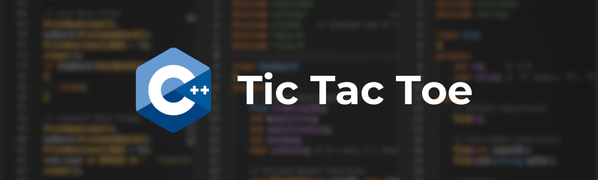
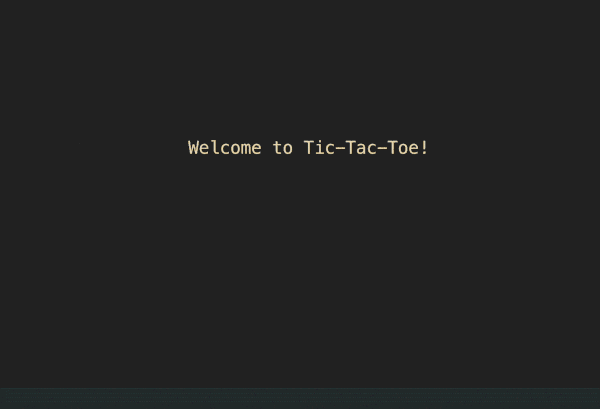

# Tic Tac Toe CPP



A classic game of Tic Tac Toe for the Command Line.

## Features

- Designed using OOP principles
- Intuitive Command Line Interface
- Screen "refreshes", giving the illusion of animation frames
- Play against the computer
- All user input is validated

## Preview



## Usage

1\. Download and cd into the project

```bash
git clone https://github.com/rioredwards/Tic-Tac-Toe.git
cd Tic-Tac-Toe
```

2\. Compile source code into binary (executable) file

```bash
make
```

3\. Run the executable file

```bash
./main
```

## Authors

- [Rio Edwards](https://github.com/rioredwards)

## Acknowledgements

- [readme.so](https://readme.so/editor)
- [Simple Icons](https://simpleicons.org/)
- [shields.io](https://shields.io/)
